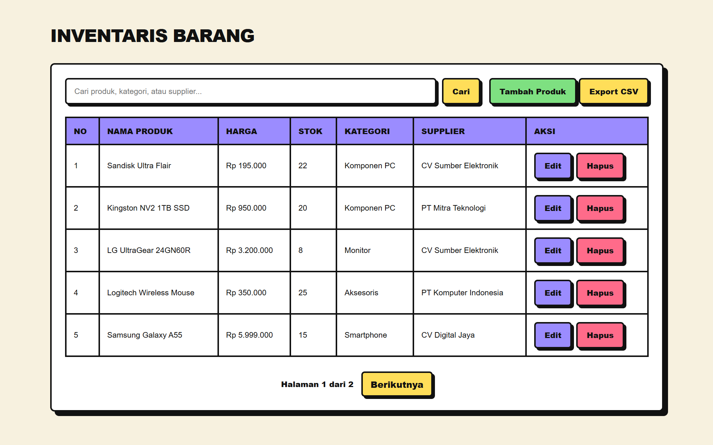
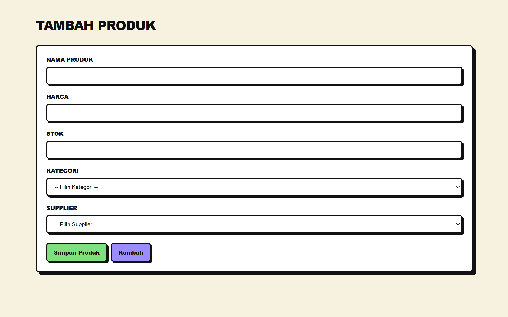
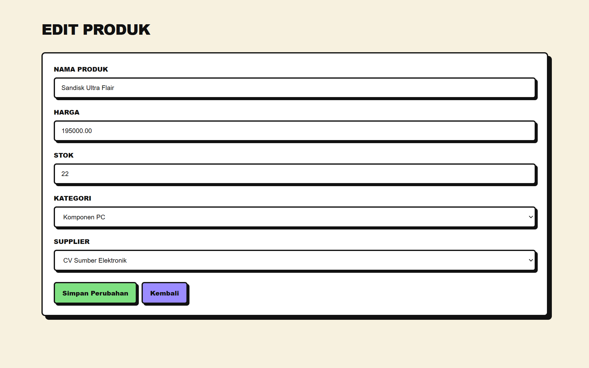
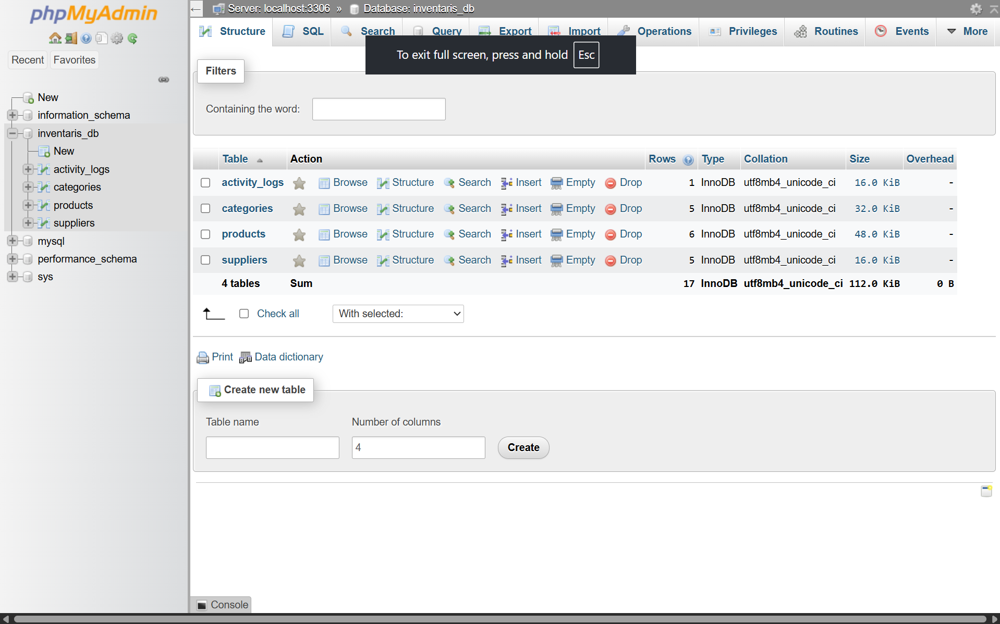

# Tugas Web Pertemuan 8 — CRUD Inventaris

## Deskripsi

Implementasi sistem **CRUD Inventaris Barang menggunakan PHP Native** dengan **MySQL sebagai database** dan **PDO sebagai koneksi database**. Tugas berfokus pada penerapan database relasional, operasi CRUD, prepared statement, validasi input, sanitasi output, transaction, serta fitur tambahan berupa search, pagination, dan export CSV.

## Requirement

| Requirement | Implementasi |
|---|---|
| Database inventaris | `inventaris_db` |
| Tabel kategori | `categories` |
| Tabel supplier | `suppliers` |
| Tabel produk | `products` |
| Activity log | `activity_logs` |
| Relasi Primary Key / Foreign Key | MySQL |
| Koneksi database | `config/database.php` |
| PDO Singleton | PHP |
| Menampilkan produk | `index.php` |
| JOIN kategori dan supplier | PDO + MySQL |
| Tambah produk | `create.php` |
| Update produk | `edit.php` |
| Delete produk | `delete.php` |
| Prepared statement | PDO |
| Sanitasi output | `htmlspecialchars()` |
| Flash message | PHP Session |
| Redirect setelah CRUD | PHP Header |
| Konfirmasi delete | JavaScript |
| Transaction | PDO Transaction |
| Activity log | `activity_logs` |
| Search | `index.php` |
| Pagination | `index.php` |
| Export CSV | `export.php` |
| Responsive design | CSS Media Query |
| Neubrutalism UI | `assets/style.css` |

## Teknologi

- PHP Native
- MySQL
- PDO
- HTML5
- CSS3
- JavaScript
- Apache
- Laragon
- phpMyAdmin
- Visual Studio Code
- Git & GitHub

## Struktur Project

```text
TugasWeb-Pertemuan8-CRUD/
├── assets/
│   └── style.css
├── config/
│   └── database.php
├── create.php
├── delete.php
├── edit.php
├── export.php
├── index.php
├── schema.sql
├── README.md
└── .gitignore
```

## Struktur Database

```text
inventaris_db
│
├── categories
│
├── suppliers
│
├── products
│
└── activity_logs
```

Relasi database:

```text
categories
     │
     │ 1 : N
     ▼
products
     ▲
     │ N : 1
     │
suppliers
```

Foreign Key:

```text
products.category_id → categories.id
products.supplier_id → suppliers.id
```

## Alur Sistem

```text
                    ┌───────────────┐
                    │    Browser    │
                    └───────┬───────┘
                            │
                            ▼
                    ┌───────────────┐
                    │   PHP Native  │
                    └───────┬───────┘
                            │
                            ▼
                    ┌───────────────┐
                    │ PDO Singleton │
                    └───────┬───────┘
                            │
                            ▼
                    ┌───────────────┐
                    │     MySQL     │
                    └───────────────┘
```

Alur CRUD:

```text
Create → Validate → Prepared Statement → INSERT → Redirect
                                      ↓
Read → JOIN → Fetch Data → htmlspecialchars() → Display
                                      ↓
Update → Validate → Prepared Statement → UPDATE → Redirect
                                      ↓
Delete → Confirmation → Transaction → DELETE → Activity Log → Commit
```

## Keamanan Dasar

Implementasi menerapkan:

- PDO sebagai database connection
- PDO Singleton
- Prepared statement
- `PDO::ATTR_EMULATE_PREPARES => false`
- Validasi input
- Type casting data numerik
- Sanitasi output dengan `htmlspecialchars()`
- Operasi DELETE menggunakan POST
- Konfirmasi sebelum DELETE
- Transaction pada proses DELETE
- Rollback jika transaction mengalami kegagalan
- Foreign Key untuk menjaga integritas relasi database

## Transaction

Proses DELETE menggunakan transaction:

```text
BEGIN TRANSACTION
       ↓
Ambil data produk
       ↓
DELETE products
       ↓
INSERT activity_logs
       ↓
COMMIT
```

Jika terjadi kesalahan:

```text
ROLLBACK
```

## Fitur Search

Search dapat digunakan untuk mencari berdasarkan:

- Nama produk
- Nama kategori
- Nama supplier

Contoh:

```text
Laptop
ASUS
Teknologi
```

Search menggunakan PDO prepared statement.

## Fitur Pagination

Data produk ditampilkan menggunakan pagination dengan batas:

```text
5 produk per halaman
```

Pagination tetap mempertahankan parameter pencarian ketika search sedang digunakan.

## Fitur Export

Data inventaris dapat diekspor menggunakan:

```text
export.php
```

Format file:

```text
CSV
```

Data yang diekspor meliputi:

```text
ID
Nama Produk
Harga
Stok
Kategori
Supplier
Dibuat
Diperbarui
```

## Tampilan

Aplikasi menggunakan konsep desain **Neubrutalism** dengan karakteristik:

- Border hitam tebal
- Solid shadow
- Warna kontras
- Tombol dengan border tebal
- Card dengan shadow
- Tipografi tebal
- Background krem
- Responsive layout

## Menjalankan Project

1. Letakkan folder project di `C:\laragon\www\`.
2. Jalankan **Apache** melalui Laragon.
3. Jalankan **MySQL** melalui Laragon.
4. Buka **phpMyAdmin**.
5. Import file `schema.sql`.
6. Database `inventaris_db` akan dibuat secara otomatis.
7. Buka browser.
8. Akses:

```text
http://localhost/TugasWeb-Pertemuan8-CRUD/
```

## Import Database

Database dapat dibuat menggunakan file:

```text
schema.sql
```

File tersebut berisi:

- Database `inventaris_db`
- Tabel `categories`
- Tabel `suppliers`
- Tabel `products`
- Tabel `activity_logs`
- Foreign Key
- Seed data
- Index database

## Requirement Checklist

- [x] Database `inventaris_db`
- [x] Tabel `categories`
- [x] Tabel `suppliers`
- [x] Tabel `products`
- [x] Foreign Key
- [x] Seed data
- [x] PDO Singleton
- [x] Read / menampilkan produk
- [x] JOIN kategori dan supplier
- [x] Create / tambah produk
- [x] Update / edit produk
- [x] Delete / hapus produk
- [x] Prepared statement
- [x] `htmlspecialchars()`
- [x] Flash message
- [x] Redirect setelah CRUD
- [x] Konfirmasi delete
- [x] Transaction
- [x] Activity log
- [x] Search
- [x] Pagination
- [x] Export CSV
- [x] Responsive design
- [x] Neubrutalism UI

## Screenshot

### Halaman Utama



### Tambah Produk



### Edit Produk



### Database



## Informasi Tugas

**Mata Kuliah:** Pemrograman Web  
**Pertemuan:** 8  
**Nama:** Fatih Taqiyyuddin  
**Repository:** `TugasWeb-Pertemuan8-CRUD`

## Author

**Fatih Taqiyyuddin**
